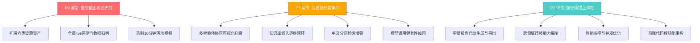

# 智辩无幻（IM-Training-Agent）挑战杯决赛冲刺技术开发优化方案

> **复核日期**：2026-09-02  
> **截止日期**：2026-09-05 提交初审，10月完善，11月终审擂台赛  
> **当前状态**：核心闭环已交付，191项单测全通过，离线评测三指标合规  

---

## 一、现状审计与评分差距分析

### 1.1 评分维度对标（百分制）

| 评分维度 | 满分 | 当前预估得分 | 差距分析 | 提升空间 |
|:---|:---:|:---:|:---|:---:|
| **作品完整性** (30分) | 30 | **24-26** | 全流程闭环已完成；但"实操指南"与"挑战任务"尚未独立成资产；视频未录 | **+4-6** |
| **技术创新性** (25分) | 25 | **20-22** | VACP协议、声明证据图、辩论裁决机制有突破性；但知识溯源可视化不够直观；缺少正式的中文分词提升 | **+3-5** |
| **用户体验** (15分) | 15 | **11-12** | 四工作台交互流畅；但协同过程可视化仅为文字日志流，缺乏DAG动态图、声明演进动画；首次加载体验有卡顿 | **+3-4** |
| **实用价值** (30分) | 30 | **22-25** | 离线评测达标；但全量 live 评测尚未完成；测试用例不足50组；知识库嵌入运维闭环未收口 | **+5-8** |
| **合计** | **100** | **77-85** | — | **+15-23** |

### 1.2 核心硬性指标现状

| 指标 | 赛题要求 | 当前状态 | 风险等级 |
|:---|:---|:---|:---:|
| 智能体数量 ≥3 | 至少3个明确分工 | ✅ 10个执行者Actor + 6个职责角色 | 🟢 已达标 |
| 资源形态 ≥3 | 至少3种个性化学习资源 | ✅ 4种已交付（讲义/PPT/习题/脉络）+ 2种待扩展 | 🟡 基本达标 |
| 幻觉率 <5% | unsupported事实Claim比例 | ⚠️ 消融实验：初稿25%→终稿0%；全量live未跑完 | 🟡 需补充live数据 |
| 适配准确率 ≥85% | 画像-难度匹配 | ✅ 离线100%（60/60）；固定队列33/33 | 🟢 已达标 |
| 覆盖率 ≥90% | 核心知识点覆盖 | ✅ 离线100%（黄金知识点全覆盖） | 🟢 已达标 |
| 测试用例 ≥50组 | 差异化测试数据 | ⚠️ 固定60案例 + 3画像；但live实测组数不足 | 🟡 需扩充 |
| 演示视频 ≤10分钟 | 完整闭环演示 | ❌ 尚未录制 | 🔴 紧急 |

---

## 二、优化方案总览（按优先级排序）



---

## 三、P0 紧急优化（截止9月5日前必须完成）

### 3.1 扩展六类资源资产契约

> [!IMPORTANT]
> 赛题明确要求"至少3种形态的个性化学习资源"。当前系统已交付4种（讲义/PPT/分层习题/知识脉络），但"实操指南"和"挑战任务"仅在任务文案中体现，尚未成为可独立交付、交互和评分的学习资产。扩展至6种将使"资源多样性"远超赛题基线，在答辩中形成显著差异化优势。

#### 3.1.1 新增资源类型定义

##### [MODIFY] [src/learning/types.ts](file:///D:/23661/桌面/IM-Training-Agent/src/learning/types.ts)
```typescript
// 当前 4 种
export type LearningResourceType = 'lecture' | 'presentation' | 'tiered_quiz' | 'concept_map';

// 扩展为 6 种
export type LearningResourceType = 
  | 'lecture'          // 讲义
  | 'presentation'     // PPT
  | 'tiered_quiz'      // 分层习题
  | 'concept_map'      // 知识脉络
  | 'practice_guide'   // 实操指南（新增）
  | 'challenge_task';  // 挑战任务（新增）
```

##### [MODIFY] [server/prompts.ts](file:///D:/23661/桌面/IM-Training-Agent/server/prompts.ts) — 新增两类资源提示词

```typescript
// RESOURCE_TYPE_LABELS 补充
practice_guide: '实操指南',
challenge_task: '挑战任务',

// TYPE_GUIDES 补充
practice_guide: [
  '这是「实操指南」：一份可直接按步骤执行的动手操作手册。',
  '写作标准：',
  '- 5 到 7 个 steps，每步一个明确可验证的操作目标；',
  '- 每步包含 instruction（操作指令）、expected（预期结果）、pitfall（常见错误）；',
  '- 至少 2 个步骤提供可运行的 Python/pandas 代码片段；',
  '- 最终给出 checkpoint（3-4 条自检清单）确认实操完成。',
].join('\n'),

challenge_task: [
  '这是「挑战任务」：一份综合性实战挑战，要求学习者独立完成一个完整的分析/诊断任务。',
  '写作标准：',
  '- scenario（150-300字的工业场景描述，含背景与数据来源）；',
  '- objectives（3-5 条挑战目标）；',
  '- deliverables（2-3 项需要交付的成果物描述）；',
  '- rubric（4-5 条评分标准，每条明确"合格/优秀"边界）；',
  '- hints（2-3 条分层提示，从方向性到具体方法递进，学习者按需展开）。',
].join('\n'),
```

##### [MODIFY] [src/learning/resource-builder.ts](file:///D:/23661/桌面/IM-Training-Agent/src/learning/resource-builder.ts) — 扩展草稿构建器

- 为 `practice_guide` 构建 step-by-step 结构化草稿
- 为 `challenge_task` 构建 scenario + rubric 结构化草稿
- 对应的 `parseLlmResourceDraft` 和 `validateLlmResourceDraftQuality` 新增两类校验

##### [MODIFY] [server/runs/executor.ts](file:///D:/23661/桌面/IM-Training-Agent/server/runs/executor.ts) — 执行器支持两类新资源

- `generate.resource` 节点按 `resourceType` 路由到对应提示词
- 审核节点对实操步骤中的代码和预期结果进行 Claim 提取

##### [MODIFY] [web/src/components/resource-workbench.tsx](file:///D:/23661/桌面/IM-Training-Agent/web/src/components/resource-workbench.tsx) — 前端渲染器

- 实操指南：步骤卡片式渲染（序号 + 指令 + 代码 + 预期 + 常见错误折叠）
- 挑战任务：场景描述 + 目标清单 + 交付物 + 评分标准 + 分层提示（渐进展开）

#### 3.1.2 工作量估算：约 2 天

---

### 3.2 全量 Live 评测与数据归档

> [!IMPORTANT]
> 赛题实用价值维度（30分）明确要求"测试用例不少于50组"且"专业知识谬误率 <5%"。当前离线评测60案例全量通过，但 live 评测仅有分层9案例+固定3画像队列。需要补充 live 数据以支撑答辩论证。

#### 3.2.1 执行策略

```bash
# 分层 live 评测：每步跑 5 个案例，逐步积累
pnpm evaluate --live --stride 5

# 全量执行（需确认模型API额度）
pnpm evaluate --live

# 消融实验刷新
pnpm ablation
```

#### 3.2.2 数据归档清单

| 数据项 | 位置 | 状态 |
|:---|:---|:---:|
| 60案例离线评测报告 | `data/evaluation-report-*.json` | ✅ |
| 3画像消融实验数据 | `data/evaluation/live-run-cohort.json` | ✅ |
| 全量live评测报告 | `data/evaluation-report-live-*.json` | ❌ 待执行 |
| 差异化画像输入输出 | `05-测试数据/差异化画像数据包/` | ✅ 3组已归档 |
| 知识库切片样本 | `05-测试数据/知识库切片/` | ✅ |

#### 3.2.3 评测报告补充
- 在 [评测方案与结果报告.md](file:///D:/23661/桌面/IM-Training-Agent/提交包-湖南师范大学—佘硕—智辩无幻—17267081925/01-作品文档/评测方案与结果报告.md) 中补充 live 全量结果
- 添加逐画像分层分析（foundation / advanced / maintenance 各自的三项指标）
- 补充与消融基线的对比表格

#### 工作量估算：约 0.5-1 天（取决于模型API调用耗时）

---

### 3.3 录制10分钟演示视频

> [!CAUTION]
> 视频是提交的硬性要求，必须在9月5日前完成。视频需"清晰展示：从差异化学习者学情画像输入，到多智能体协同调度与交互过程的可视化，再到最终个性化领域知识资源生成的完整闭环"。

#### 3.3.1 推荐视频脚本大纲

| 时间段 | 内容 | 演示重点 |
|:---:|:---|:---|
| 0:00-0:30 | 项目概述与核心主张 | "以多智能体辩论裁决实现零幻觉个性化训练" |
| 0:30-1:30 | **画像A（零基础）**：注册→建档→12题诊断 | 展示BKT初始化、路径自动生成 |
| 1:30-3:00 | 画像A发起学习任务→多智能体协同过程 | DAG节点流转、6角色协同、SSE实时推送 |
| 3:00-4:00 | 资源生成结果（讲义）→Claim审核→辩论裁决 | 逐条Claim审核、反方质询、裁决修订 |
| 4:00-4:30 | **画像B（进阶）**快速切换 | 对比路径差异、难度校准差异 |
| 4:30-5:30 | 画像B的PPT+分层习题→作答→BKT更新 | 作答反馈→掌握度变化→下一步决策 |
| 5:30-6:30 | 苏格拉底追问→路径动态调整 | 启发式多轮问答、置信度提升 |
| 6:30-7:30 | 验证工作台→产物溯源→离线复验 | DAG追溯、Claim图谱、Hash校验 |
| 7:30-8:30 | 知识库治理→来源版本→策展门禁 | 受管原件→质量门禁→正式切片 |
| 8:30-9:30 | 实用价值与量化结果 | 三项指标数据、消融实验对比 |
| 9:30-10:00 | 技术架构总结与创新亮点 | VACP协议、声明证据图、可迁移性 |

#### 工作量估算：约 0.5 天（录制 + 剪辑）

---

## 四、P1 高优优化（显著提升竞争力）

### 4.1 多智能体协同可视化升级

> [!TIP]
> 赛题用户体验维度（15分）明确要求"多智能体协同调度过程与决策逻辑可视化交互流畅"。当前学习页的协同过程仅以文字消息流呈现，缺乏DAG节点状态动态图和Claim声明演进可视化，这是与满分之间最大的差距。

#### 4.1.1 实时 DAG 进度可视化组件

在学习工作台（`learning-workbench.tsx`）右侧或顶部增加一个轻量级 DAG 进度可视化面板：

```
┌──────────────────────────────────────────────────────────────┐
│  ⓵ 学情建模    ⓶ 数据检索    ⓷ 文档检索    [并行完成 ✓]    │
│       └─────────────┬─────────────┘                          │
│                ⓸ 领域分析 ✓                                  │
│                     │                                        │
│              ⓹ 资源生成 ⟳                                   │
│                     │                                        │
│          ⓺ 逐条审核 → ⓻ 反方质询 → ⓼ 证据裁决               │
│                                         │                    │
│              ⓽ 隐私合规 → ⓾ 发布收尾                         │
│                                                              │
│  [当前阶段: 资源生成 · 耗时 12.3s · 第1轮]                     │
└──────────────────────────────────────────────────────────────┘
```

**实现方案**：
- 复用现有 SVG `TreeCanvas` 布局引擎，绘制固定 10 节点 DAG 拓扑
- SSE `node.started` / `node.succeeded` / `node.failed` 事件驱动节点颜色与动画状态
- 修订环以虚线箭头回连到 `generate.resource`，动态显示 "第N轮修订"

##### [NEW] `web/src/components/dag-progress.tsx`
- SVG 固定布局的 10 节点 DAG 组件（约 200-300 行）
- 状态驱动：`pending` | `running` | `succeeded` | `failed` | `revision`
- 动画：running 节点脉冲效果、succeeded 节点打钩、failed 节点红色高亮

#### 4.1.2 Claim 声明演进可视化

在验证工作台或资源详情中增加 Claim 演进图谱：

```
┌──────────────────────────────────────────┐
│  📋 Claim 声明演进 (共 12 条事实声明)      │
│                                          │
│  初稿声明 ──────────────── 终稿声明       │
│                                          │
│  ✅ C1: 数值型 → supported               │
│  🔄 C2: 因果型 → review → ✅ supported   │
│  ❌ C3: 数值型 → unsupported → 🔄 修订   │
│     └→ C3': 修订后 → ✅ supported        │
│  ✅ C4: 步骤型 → supported               │
│  ...                                     │
│                                          │
│  门禁结论: ✅ 已发布 (第2轮修订通过)       │
│  幻觉率: 0% (12/12 事实声明获证据支持)     │
└──────────────────────────────────────────┘
```

**实现方案**：
- 基于 `claims` 表的 `logical_key` 和 `supersedes_claim_id` 绘制声明演进链
- 颜色编码：`supported`=绿、`review`=黄、`unsupported`=红
- 可展开查看每条 Claim 的绑定证据和核验报告

#### 工作量估算：约 1.5-2 天

---

### 4.2 知识库嵌入运维闭环

> [!NOTE]
> 赛题要求"至少1个垂直领域的专业知识库切片"。当前19份受管资料均处于候选状态，混合检索主要依赖616条既有知识卡切片。需要将候选资料通过策展门禁晋升为正式知识库切片，补齐嵌入向量，并建立可观测的运维闭环。

#### 4.2.1 候选资料策展批量执行

```bash
# 对19份候选资料执行策展门禁
pnpm knowledge:curate

# 验证已通过策展的资料切片数量
pnpm knowledge:status
```

#### 4.2.2 嵌入回填与向量索引

##### [MODIFY] [scripts/](file:///D:/23661/桌面/IM-Training-Agent/scripts) — 嵌入回填脚本增强

```typescript
// 增加可观测状态：
// - 待嵌入 (pending_embedding)
// - 嵌入中 (embedding_in_progress)  
// - 已嵌入 (embedded)
// - 嵌入失败待重试 (embedding_failed)
```

- 在 `document_chunks` 表的 `metadata` 中记录嵌入状态
- 提供 `pnpm knowledge:embed-status` 查看嵌入进度
- 失败重试：最多3次，指数退避

#### 4.2.3 检索质量验证

- 在黄金知识点评测集上测试 `Recall@20` 不低于当前基线
- 新增资料后的 `nDCG@8` 提升报告

#### 工作量估算：约 1 天

---

### 4.3 中文分词检索增强

> [!TIP]
> 当前 PostgreSQL 全文检索使用 `'simple'` 分词器，中文长句的专业术语召回率受限。引入中文分词可显著提升检索精度，直接作用于"核心知识点覆盖率"指标。

#### 4.3.1 方案选择

| 方案 | 实现复杂度 | 效果预估 | 推荐度 |
|:---|:---:|:---:|:---:|
| **Node端预分词入库** | 低 | 中 | ⭐⭐⭐ 推荐 |
| pg_jieba 扩展 | 中 | 高 | ⭐⭐ 备选 |
| 独立 Elasticsearch | 高 | 高 | ❌ 不推荐 |

#### 4.3.2 推荐方案：Node端预分词

##### [MODIFY] [server/db/pg-evidence.ts](file:///D:/23661/桌面/IM-Training-Agent/server/db/pg-evidence.ts)

```typescript
import { cut } from '@aspect/jieba';  // 或使用 nodejieba

// 在知识切片入库时，对 content 进行分词并构建增强的 search_text
function buildSearchText(content: string): string {
  const words = cut(content, true); // HMM 分词
  // 保留原文 + 分词结果（空格连接），让 PG FTS 同时匹配长短词
  return `${content} ${words.join(' ')}`;
}
```

- 仅影响入库环节，不改变检索查询逻辑
- 增量式：新入库切片自动分词，已有切片可批量回填
- 回退安全：分词库不可用时 fallback 到原始文本

#### 工作量估算：约 0.5 天

---

### 4.4 模型调用健壮性加固

> [!WARNING]
> 赛题评审环境可能网络不稳定，模型服务商可能限流。需要确保演示和评测过程中系统稳定运行，避免因模型调用失败导致整个协同流程崩溃。

#### 4.4.1 AbortSignal 超时取消

##### [MODIFY] [server/runs/executor.ts](file:///D:/23661/桌面/IM-Training-Agent/server/runs/executor.ts)

```typescript
// 当前 withTimeout 仅 reject，不取消底层请求
// 改为传入 AbortController.signal，真正取消 HTTP 请求

const controller = new AbortController();
const timeout = setTimeout(() => controller.abort(), NODE_TIMEOUT_MS);

try {
  const response = await multiModelClient.chat({
    messages,
    model: route.model,
    signal: controller.signal,  // 新增
    // ...
  });
} finally {
  clearTimeout(timeout);
}
```

#### 4.4.2 令牌桶限流器

##### [NEW] `server/rate-limiter.ts`

```typescript
// 简单的令牌桶实现，防止并发请求被服务商 429
export class TokenBucketLimiter {
  private tokens: number;
  private readonly maxTokens: number;
  private readonly refillRate: number; // tokens/second
  
  async acquire(): Promise<void> {
    while (this.tokens <= 0) {
      await new Promise(resolve => setTimeout(resolve, 100));
    }
    this.tokens--;
  }
}
```

- 默认 RPM 限制：10 requests/minute（可通过 `.env` 配置）
- 集成到 `MultiModelClient` 的 `chat()` 和 `streamText()` 入口

#### 4.4.3 429 智能退避重试

```typescript
// HTTP 429 时读取 Retry-After 头，按指数退避重试
// 最多重试 3 次，间隔 2s → 4s → 8s
```

#### 工作量估算：约 0.5-1 天

---

## 五、P2 中优优化（加分项）

### 5.1 学情报告自动生成与导出

> [!NOTE]
> 赛题要求"支持生成可视化的个人学情与资源匹配度报告"。当前画像弹窗展示了能力雷达和BKT数据，但缺乏完整的、可导出的学情报告PDF/HTML。

#### 5.1.1 报告内容结构

```
📊 个人学情与资源匹配度报告
├── 1. 学习者画像摘要
│   ├── 基本信息（匿名化处理）
│   ├── 学习目标与起点
│   └── 入学诊断结果（五维雷达图）
├── 2. 知识盲区定位
│   ├── BKT 掌握概率热力图（按知识点）
│   ├── 薄弱环节列表（p < 0.45 的知识点）
│   └── 先修缺口分析
├── 3. 资源难度匹配曲线
│   ├── 历次资源的难度校准记录
│   ├── 预计成功率 vs 实际表现趋势
│   └── 脚手架强度调整轨迹
├── 4. 学习路径规划图
│   ├── 当前路径拓扑（已掌握/学习中/待学习）
│   ├── 推荐下一步节点与依据
│   └── 多智能体决策历史
└── 5. 多智能体协同审计摘要
    ├── 本学期运行总数与通过率
    ├── 幻觉治理效果（初稿→终稿改进）
    └── 代表性审核案例
```

#### 5.1.2 实现方案

##### [NEW] `server/report-generator.ts`
- 聚合 BKT 状态、路径图、学习决策、运行记录
- 生成结构化 JSON → 前端渲染为 HTML → 浏览器 `window.print()` 导出 PDF

##### [NEW] `web/src/components/report-view.tsx`
- 报告页面组件，包含图表（SVG 雷达图、折线图、热力图）
- 一键导出按钮

#### 工作量估算：约 1.5-2 天

---

### 5.2 跨领域迁移能力展示

> [!TIP]
> 赛题评选标准中"技术方案具备良好的领域泛化与可迁移能力"可加分。当前系统深度绑定"工业设备数据分析"场景，但架构设计本身是领域无关的。需要在文档和演示中明确展示可迁移性。

#### 5.2.1 文档层面

在 [作品设计实现方案.md](file:///D:/23661/桌面/IM-Training-Agent/提交包-湖南师范大学—佘硕—智辩无幻—17267081925/01-作品文档/作品设计实现方案.md) 中补充：

```markdown
## 领域迁移指南

### 迁移步骤（以"智能制造质量检测"为例）
1. 替换知识库资料包（PDF/Markdown → 受管来源 → 策展切片）
2. 导入结构化数据集（CSV → dataset_rows → SQL 精确查询）
3. 修改 12 题诊断题库（`src/learning/diagnostic.ts`）
4. 调整路径规划提示词中的领域关键词
5. 系统自动适配：BKT/难度校准/审核门禁/辩论裁决均为领域无关

### 架构可迁移性保证
- 提示词系统参数化设计，领域知识注入不改核心代码
- EvidencePack 抽象：结构化数据 + 文档切片 + 可选网络补全
- Claim 审核纯函数：数值/因果/字段含义核验不绑定特定领域
```

#### 5.2.2 代码层面（可选，如时间允许）

- 抽取领域配置文件 `domain.config.ts`，将诊断题、路径模板、数据集映射集中
- 提供 `pnpm domain:scaffold <domain-name>` 脚手架命令

#### 工作量估算：文档层面 0.5 天，代码层面 1 天

---

### 5.3 性能监控与并发优化

#### 5.3.1 Redis SSE 订阅优化

> [!NOTE]
> 当前每个 SSE 连接独立创建 Redis 客户端，高并发时 Redis 连接数可能成为瓶颈。

##### [MODIFY] [server/runs/events.ts](file:///D:/23661/桌面/IM-Training-Agent/server/runs/events.ts) → 单连接广播

```typescript
// 方案：服务端维护单个 Redis 订阅连接 + EventEmitter 分发
class RunEventHub {
  private subscriber: Redis;
  private emitter = new EventEmitter();
  
  subscribe(runId: string, handler: (event: RunEvent) => void) {
    this.emitter.on(`run:${runId}`, handler);
    // 首次订阅时才 SUBSCRIBE Redis channel
  }
  
  unsubscribe(runId: string, handler: (...args: any[]) => void) {
    this.emitter.off(`run:${runId}`, handler);
    // 最后一个监听器移除时 UNSUBSCRIBE
  }
}
```

#### 5.3.2 PostgreSQL 连接池收敛

- 确保全局唯一 Pool 实例
- 配置合理的 `max`（默认10）和 `idleTimeoutMillis`

#### 工作量估算：约 0.5 天

---

### 5.4 前端代码模块化（低优先级，赛后可做）

> [!NOTE]
> CLAUDE.md 明确"不得因为个人审美或顺手重构而大改结构"。此项仅作为赛后维护建议，不在截止前执行。

建议方向：
- 拆分 `resource-workbench.tsx`（61KB）→ `components/resource/` 子目录
- 抽取统一 API Client 层（替代散落的 fetch 调用）
- 引入轻量状态管理（Context 或 Zustand）替代 `CustomEvent` + `localStorage`

---

## 六、实施排期建议

> [!IMPORTANT]
> 距离 9月5日 提交截止仅剩 **3天**。以下排期聚焦 P0 和部分 P1 任务。

| 日期 | 上午 | 下午 | 晚间 |
|:---:|:---|:---|:---|
| **9月2日** | P0.1 六类资源类型定义与提示词 | P0.1 资源构建器与执行器扩展 | P1.4 模型调用加固（AbortSignal） |
| **9月3日** | P0.1 前端渲染器（实操指南+挑战任务） | P1.1 DAG进度可视化组件 | P0.2 启动全量live评测 |
| **9月4日** | P1.2 知识库嵌入运维闭环 | P0.2 评测数据归档+报告更新 | P0.3 录制演示视频 |
| **9月5日** | 提交包终审+SHA-256校验 | **提交** | — |

---

## 七、验证计划

### 7.1 自动化验证

```bash
# 类型检查
pnpm typecheck

# 单元测试（目标：191+ 项全通过）
pnpm test

# Lint 检查
pnpm lint

# 前端生产构建
pnpm --dir web build

# 评测基线验证
pnpm evaluate

# 消融实验验证
pnpm ablation

# 差异检查
git diff --check
```

### 7.2 手动验证清单

- [ ] 新用户注册 → 建档 → 12题诊断 → 路径生成 全流程
- [ ] 零基础画像发起讲义/PPT/习题/脉络/实操指南/挑战任务 各一次
- [ ] 进阶画像发起同上，对比难度校准差异
- [ ] 习题作答 → BKT 更新 → 决策生成 → 苏格拉底追问
- [ ] 验证工作台查看完整产物链、Claim图谱、Hash校验
- [ ] 设置页添加/切换模型服务 → 重新生成
- [ ] 数据导出功能正常

### 7.3 提交前终审清单

- [ ] `pnpm test` 全通过
- [ ] `pnpm typecheck` 零错误
- [ ] 前端生产构建成功
- [ ] 演示视频 ≤10分钟、清晰展示完整闭环
- [ ] 评测报告数字与实际 JSON 一致
- [ ] 提交包内所有文档 SHA-256 与仓库一致
- [ ] `.env` 和密钥未进入提交包
- [ ] 部署说明可独立复现

---

## 八、风险与缓解

| 风险 | 概率 | 影响 | 缓解措施 |
|:---|:---:|:---:|:---|
| 模型API额度不足导致live评测中断 | 中 | 高 | 分层执行 `--stride 5`；优先用 qwen-plus（成本低） |
| 新增资源类型引入回归Bug | 中 | 中 | 增量开发，每种类型完成后立即跑全量测试 |
| 视频录制时模型服务不稳定 | 低 | 高 | 提前录制多次，选取最稳定的一次；准备降级方案说辞 |
| DAG可视化组件复杂度超预期 | 低 | 中 | 优先实现简单的线性进度条，复杂SVG DAG作为增强 |
| 知识库策展批量执行超时 | 低 | 低 | 分批执行；失败候选保留，不影响已有检索 |

---

> [!IMPORTANT]
> **核心原则**：所有优化必须遵循 CLAUDE.md 的前端保护原则和测试投入原则。不为了"清理"或"美化"破坏已有功能。每轮改动后必须通过 `pnpm test` + `pnpm typecheck` + 前端构建。
