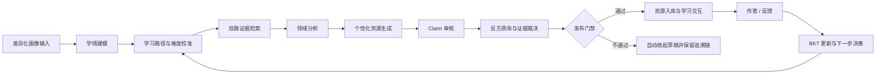
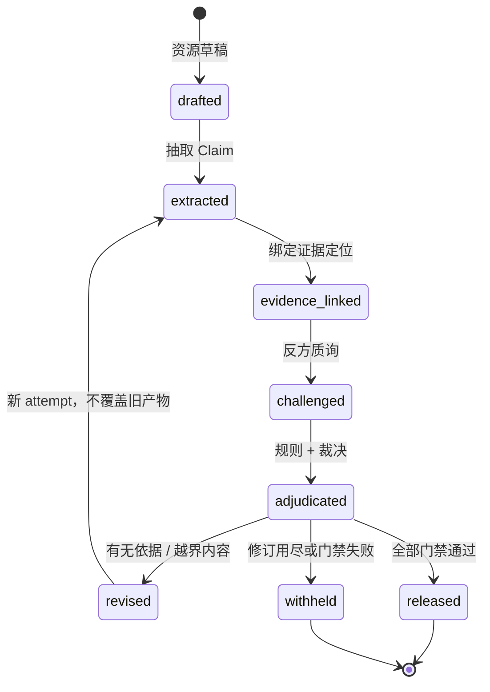
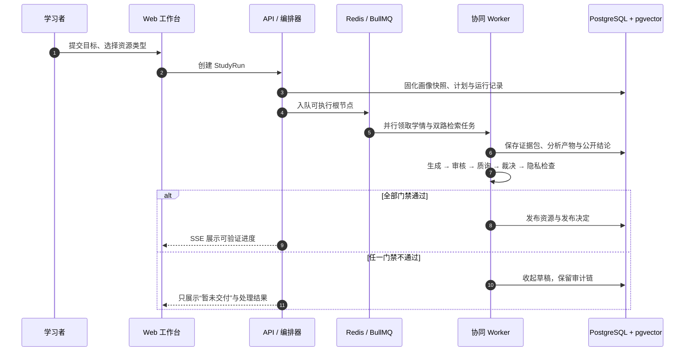
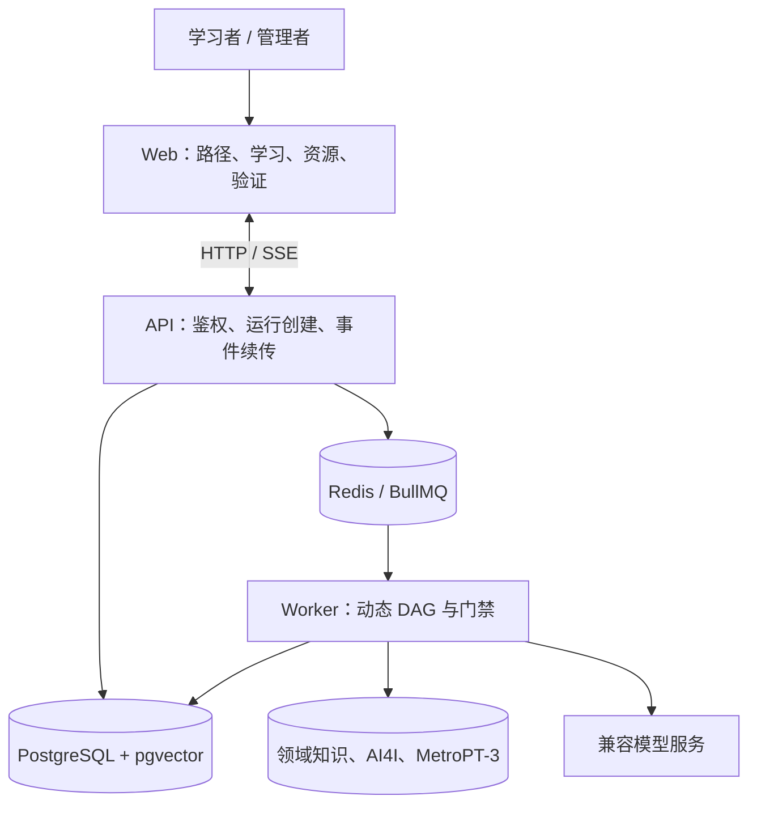
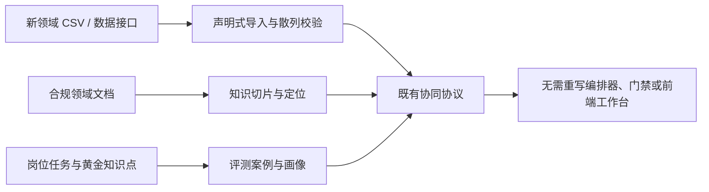

# 智辩无幻：领域知识个性化生成与多智能体协同决策系统

> **面向场景**：工业设备数据分析与故障诊断技能训练
>
> **作品定位**：让学习者的基础、目标与反馈决定“怎么教”，让可定位证据与多智能体门禁决定“能教什么、能否发布”。
---

## 1. 要解决的问题

工业设备培训中的大模型应用同时面对两类风险：

1. **同一份材料不适合不同人**：零基础学习者需要概念拆解与低门槛练习，已有经验的运维人员需要证据边界、诊断逻辑与可执行表达。
2. **专业内容不能“生成了再相信”**：字段含义、数据数值与故障因果一旦编造，会直接误导设备判断。仅靠单一模型自检，无法形成可审计的事实约束。

系统将这两个问题解耦：

| 要解决的问题 | 系统机制 | 可核验结果 |
|---|---|---|
| 难度与学习路径不匹配 | 画像图 + BKT + 难度校准 + 反馈决策 | 路径状态、BKT 更新和 `learning_decisions` 可追溯 |
| 专业事实可能漂移 | 声明—证据图 + 确定性核验 | 每条事实 Claim 绑定可定位证据 |
| 单模型审核不可靠 | 独立质询 + 裁决取更严格结论 | 初稿、质询、裁决、修订链完整保存 |
| 未通过资源误交付 | fail-closed 发布门禁 | 任何审核/裁决/隐私门禁不通过即不入库 |
| 系统成为黑盒 | 动态 DAG、SSE 事件与验证工作台 | 节点状态、公开依据和最终决策可视化 |

### 1.1 端到端闭环



这不是把多个模型顺序串联。每一步都有明确输入、输出、持久化产物与失败语义：个性化只影响解释方式、难度和下一步；事实结论必须由证据与门禁决定。

---

## 2. 核心方法：双图一链

### 2.1 学情图：决定如何教

学习者的知识点状态包含掌握概率、猜测率、失误率、学习转移率和置信度。诊断作答、习题判分、资源反馈与启发式追问都会产生可追踪的 BKT 更新。

资源难度由下式确定，而非固定套用同一难度：

```text
readiness = 0.60 × 掌握度 + 0.25 × 先修就绪度 + 0.15 × 置信度
```

系统据此选择讲义、PPT、分层习题或知识脉络，并将预计成功率调入 **65%–80%** 的教学区间。反馈后，决策模块输出“补强、继续、进阶、先追问”之一，并把理由、BKT 前后值与来源决策持久化。

### 2.2 声明证据图：决定能够教什么

资源草稿中的事实内容会拆为原子 Claim，区分数值、字段含义、方法步骤、因果判断、风险建议和非事实教学表达。每条可审计 Claim 都要链接到结构化数据行或领域文档定位；非事实教学表达不计入幻觉率分母，避免把正常的教学引导误判为事实错误。



### 2.3 协同运行链：决定为什么这样做

一次任务对应一条动态 DAG，而非单段聊天文本。根节点可并行检索，后续节点由依赖关系触发；每个节点先持久化不可变产物，再标记成功。事件拥有单调递增序号，SSE 断线后可以续传。



---

## 3. 多智能体协同设计

### 3.1 六类职责、十个可审计执行者

| 业务职责 | 执行者 | 输入 | 产出 | 不可替代的约束 |
|---|---|---|---|---|
| 学情建模 | `learner_modeler` | 画像、作答、反馈、路径 | 难度与教学要求 | 不改变专业事实 |
| 证据检索 | `structured_retriever`、`document_retriever` | 任务、数据、知识切片 | 双路证据包与定位 | 证据不足时提高风险等级 |
| 领域分析 | `domain_analyst` | 证据包、知识边界 | 讲解要点与专业边界 | 不把相关性写成确定因果 |
| 资源生成 | `resource_author` | 资源类型、画像、证据、边界 | 结构化资源草稿 | 只能交付所选资源类型 |
| 交叉验证 | `claim_auditor`、`red_team_critic`、`evidence_judge` | 草稿、Claim、证据 | 审核、质询、裁决 | 裁决不得比规则更宽松 |
| 隐私与发布 | `privacy_guard`、`publisher` | 运行产物、隐私状态、裁决 | 隐私结论、发布决定 | 不通过则不入资源库 |

自定义协同模式可裁剪业务角色，但审核、质询、裁决、隐私、发布五道门禁始终不可移除。模型服务暂时不可用时，数值、字段字典、引用范围、越界因果等确定性规则仍可独立阻断发布。

### 3.2 可视化系统架构

完整交互图位于 [《系统架构与可信协同图.html》](系统架构与可信协同图.html)。它是自包含文件，可离线打开、缩放、切换主题并查看两条阅读路径；图中所有组件均附有当前仓库源文件引用。



**数据职责边界**：PostgreSQL 是画像、路径、运行、证据、Claim、产物和发布决定的唯一业务事实源；Redis 只承担队列、锁和事件分发，不作为业务数据存储。

---

## 4. 幻觉治理与可复核性

### 4.1 四层防线

1. **证据先行**：数据行与文档切片分别检索；引用携带数据集、行号、时间窗、来源或页码定位。
2. **确定性核验**：数值与证据逐项比对，字段含义与字段字典比对，绝对化因果表述与引用越界被拦截。
3. **独立质询与裁决**：批评执行者不读取生成端理由，仅基于草稿、Claim、证据寻找反例；裁决结果与规则结果取更严格者。
4. **fail-closed 发布**：无审核产物、存在 `unsupported` Claim、引用不可定位、裁决不通过或隐私不通过，均不发布给学习者。

### 4.2 可审计产物协议（VACP）

- 节点之间仅通过产物 ID 引用；产物使用稳定 JSON 序列化并计算 SHA-256。
- 返修使用新的 `attempt` 产物，不覆盖上一轮草稿、Claim 或裁决。
- 每个产物包含输入引用、公开结论、证据引用、下一步动作与模型/提示词配置散列；模型隐式思维链不展示、不保存、不导出。
- `pnpm verify:export <导出包>` 可离线检查散列、DAG 依赖、事件序号、输入引用、Claim—Evidence、裁决不放松、fail-closed 发布与敏感信息泄漏。

---

## 5. 个性化资源与交互反馈

系统当前交付四种可直接学习的资源形态，已超过赛题“至少三种”的要求：

| 资源 | 面向学习者的内容结构 | 反馈如何进入下一轮 |
|---|---|---|
| 讲义 | 白话术语、分节正文、代码/数据摘录、误区对照、自测问题 | 阅读反馈调整脚手架与推荐 |
| PPT | 一页一个判断、页面说明、放映、笔记、导出 | 学习者可记录理解与薄弱点 |
| 分层习题 | L1–L3 选择、填空、简答；允许再次作答 | 判分与自评更新知识点状态 |
| 知识脉络 | 关系图、节点解读、阅读路径、小检查问题 | 节点完成情况反馈到路径 |

**动态决策闭环**：答错不直接贴“不会”标签；系统记录作答证据、BKT 更新和先修关系，再给出补强资源、继续学习、进阶挑战或追问的可解释决策。路径与资源匹配报告始终读取服务端事实，页面切换不改变任务真实状态。

---

## 6. 数据合规与领域迁移

### 6.1 数据合规

- 用户身份只从 HttpOnly 会话推导，URL、请求体和队列消息不作为授权依据；账号间资源、路径与验证记录严格隔离。
- 用户上传资料默认仅用于当前任务；只有用户明确同意并经智能策展、敏感信息阻断、相关性与质量门禁后，才允许进入版本化知识来源。
- 导出前扫描 password、API Key、Cookie、token 与上传正文；发现即失败。导出数据均为脱敏样例和公开许可资料。
- AI4I 2020 与 MetroPT-3 仅作为工业设备数据分析训练素材；系统强调“数据异常支持风险判断，不等于确定故障”。

### 6.2 领域迁移

协议、门禁、产物、验证页、BKT、难度校准与评测逻辑不依赖特定行业。迁移到新领域只需提供：



---

## 7. 测试设计与结果

### 7.1 自动化测试与构建

已执行验证：

| 验证项 | 实测结果 | 关注点 |
|---|---:|---|
| `pnpm test` | **27 个测试文件 / 204 项通过** | 协同编排、产物散列、Claim 核验、画像决策、资源结构、账号隔离等 |
| `pnpm typecheck` | 通过 | TypeScript 类型契约 |
| `pnpm --dir web build` | 通过 | 前端生产构建 |
| `pnpm evaluate` | **60/60 通过** | 三画像×20：难度适配 100%、知识覆盖 100%；离线模式不调用模型，幻觉率如实为 N/A |
| `pnpm ablation` | **3/3 通过** | 动态 DAG、发布门禁、难度校准的消融对照 |

### 7.2 固定真实运行队列

三组差异化画像导出包均已通过完整性校验与离线回放：

| 画像 | 初稿 → 终稿幻觉率 | 修订轮次 | 可复算证据引用 | 校验结论 |
|---|---:|---:|---:|---|
| 零基础学习者 | 12.5% → 0% | 2 | 35 | 通过 |
| 进阶学习者 | 37.5% → 0% | 2 | 32 | 通过 |
| 在职转岗学习者 | 25.0% → 0% | 3 | 43 | 通过 |

三组按 Claim 数量加权后的门禁消融结果为：初稿幻觉率 **25.0%**、终稿 **0%**、净增益 **25 个百分点**；三组均触发返修。难度消融中，动态校准 **33/33** 落入 65%–80% 教学区间，历史固定难度仅 **2/33** 落入区间。

> **评测范围**：60 案例离线评测验证难度适配与知识覆盖；真实模型生成的幻觉治理以三组可复算固定运行队列为实测依据。详见《评测方案与结果报告》。

---

## 8. 与赛题要求的直接对应

| 赛题要求 | 对应实现 | 核验材料 |
|---|---|---|
| 垂直领域技能培训与差异化适配 | 工业设备数据分析；三画像、BKT、难度校准与路径 | `05-测试数据/差异化画像数据包/` |
| ≥3 个职责明确的 Agent，分析—生成—校验—决策闭环 | 六类职责、十个执行者、动态 DAG 与五道发布门禁 | 第 3 节、导出运行记录 |
| ≥3 种个性化资源 | 讲义、PPT、分层习题、知识脉络四类 | 源码与产品演示 |
| 可视化学情、匹配与路径 | 画像、路径图、验证工作台与可验证协同图 | 系统演示视频、HTML 图附件 |
| 反馈驱动动态迭代 | 作答/反馈→BKT→决策→下一运行 | 运行导出包与源码 |
| 幻觉防控与知识溯源 | Claim—Evidence、质询、裁决、fail-closed、离线回放 | 评测报告、三组导出包 |
| 数据合规与伦理 | 会话隔离、临时上传、策展门禁、导出脱敏 | 第 6 节、完整性校验 |
| 代码、部署与单元测试 | 可执行源代码、部署说明、27/204 自动化测试 | `04-源码/`、根目录部署说明、单元测试说明 |

---

## 9. 复现入口

| 目的 | 位置 / 命令 |
|---|---|
| 部署系统 | [《系统部署说明》](../系统部署说明.md) |
| 查看代码 | `04-源码/im-training-agent-源码.zip` |
| 运行单元测试 | `pnpm test`、`pnpm typecheck`、`pnpm --dir web build` |
| 复算 60 案例 | `pnpm evaluate` |
| 复算三项消融 | `pnpm ablation` |
| 校验任意导出包 | `pnpm verify:export <file>` 与 `pnpm replay:run <file>` |
| 查看数据与三画像输入输出 | `05-测试数据/` |
